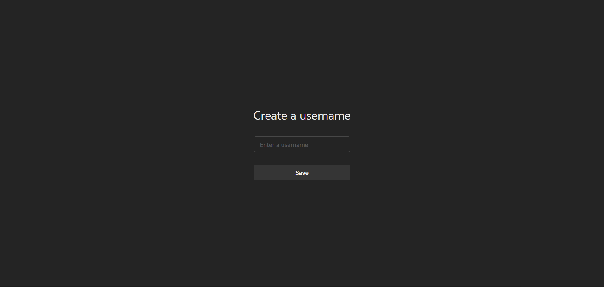
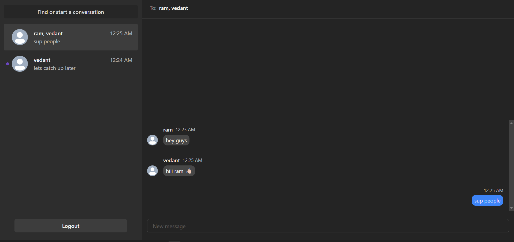

## iMessage Clone

 *Overview*

iMessage clone built with cutting-edge technologies, including Next.js, GraphQL, Prisma, TypeScript, Chakra UI, Web Sockets, and MongoDB. The application not only replicates the sleek user interface of iMessage but also incorporates advanced functionalities such as group chat and OAuth authentication using NextAuth.

*Features*

1. *Next.js*: Utilizes the power of React with the simplicity of Next.js for a seamless and efficient front-end experience.
2. *GraphQL*: Implements a flexible and efficient API with GraphQL to handle data queries and mutations.
3. *Prisma*: Employs Prisma as the data access layer for a type-safe database interface and powerful querying capabilities.
4. *Chakra UI*: Enhances the UI with a customizable and responsive design system, ensuring a polished and user-friendly experience.
5. *Web Sockets*: Enables real-time communication through Web Sockets, facilitating instant message updates and a dynamic chat experience.
6. *MongoDB*: Leverages MongoDB as the database solution for scalable and flexible data storage.
7. *Group Chat*: Introduces a group chat feature, allowing users to engage in conversations with multiple participants.
8. *OAuth with NextAuth*: Implements secure OAuth authentication using NextAuth for a seamless and secure login process.

*Screenshots*

*🔐 Secure OAuth authentication using NextAuth for a seamless and secure login process.*

*Create unique username for every user.*

*Group chat feature which allows users to engage in conversations with multiple participants.*

